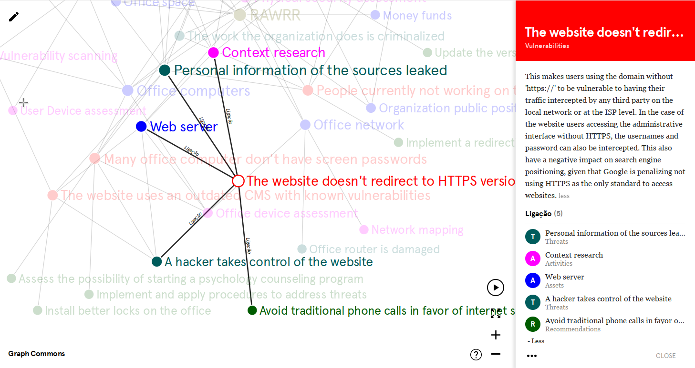

# rawrr2graph

rawrr2graph transforms data from a RAWRR JSON report into another JSON file
suitable for importing into [GraphCommons](https://graphcommons.com).

RAWRR is a multiplatform app that assists with note taking and report
generation for security evaluations.

[Main website](https://conexo.org/project/rawrr/)

[Source code repository](https://github.com/ConexoLA/RAWRR)

RAWRR maintains its data in a SQLite database, which is presented and
modified by users through essentially as one table per seection (Assets,
Vulnerabilities, etc) with insert, edit and delete operations. All sections
interrelate -- for example, a Vulnerability may relate to a single Asset, and multiple
Threats -- and these relations are specified through drop-down lists and
checkboxes.

Graph Commons is a collaborative platform for making, analyzing, and
publishing data-networks.

[Website](https://graphcommons.com/)

This script was built as a prototype for exploration of alternatives views to risk
assessment data collected through RAWRR.



(a Graph Commons representation of RAWRR with default testing
data -- [see live](https://graphcommons.com/graphs/171e7db1-af11-4e51-a93a-4f3ce3a534d4?auto=true&show=info))

The platform was chosen for the author's experience in using its import
format.

Pros:

- Works directly through the browser, with no software installation required

- Provides a very good exploration environment for the data

Cons:

- Software as a service

- Paid subscription is required for creating private graphs.

- Data is not encrypted at the server; is available to service maintainers and other possible actors; in the specific case of a risk assessment process the privacy policy and the risk scenario of the organization must be carefully considered.


Future work could be done in using other formats and platforms such as
[NetworkX](https://networkx.org/),
[D3.js](https://www.d3-graph-gallery.com/network), or
[Cytoscape.js](https://js.cytoscape.org/)


## Usage

First, in RAWRR, create a report in JSON format containing all data.

Then, run `rawrr2graph.py` with the report as argument and output it to the
desired file:

```bash
$ python3 rawrr2graph.py example.json > graphcommons.json
```

The output file should be then imported to a new Graph Commons graph.

The script was last tested using RAWRR v1.2.5 in english. Different languages require tweaking `SECTIONS_DATA` variable with the respective localized versions.
